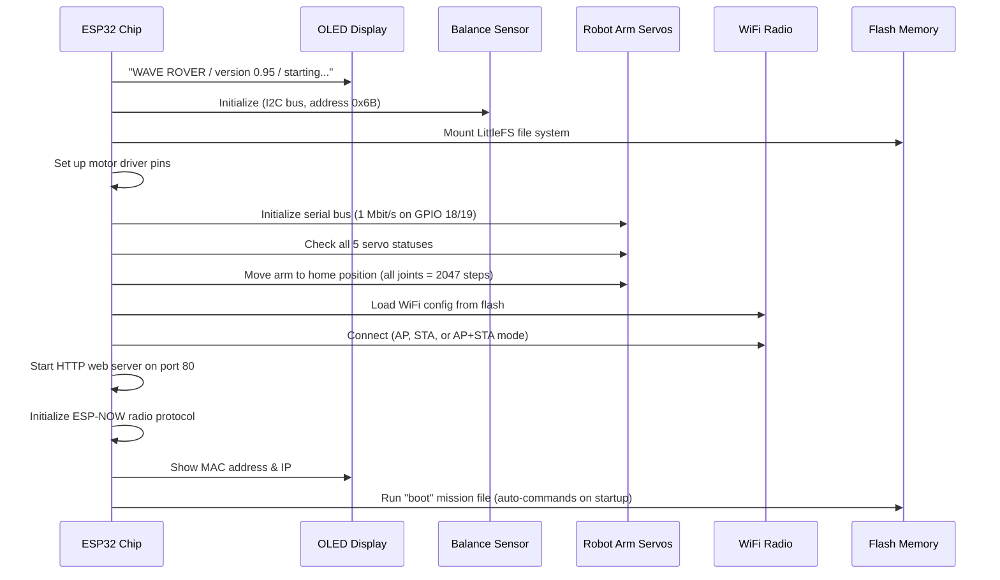
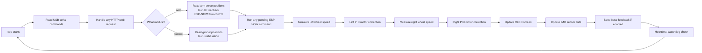
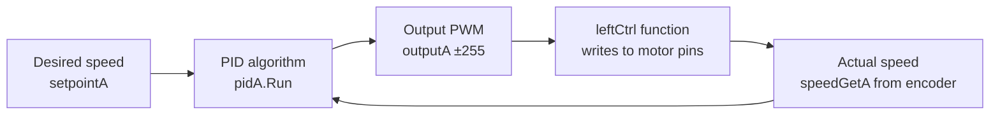
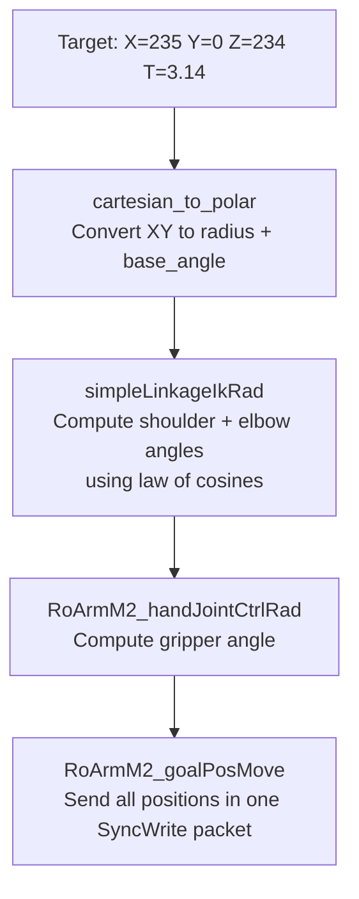
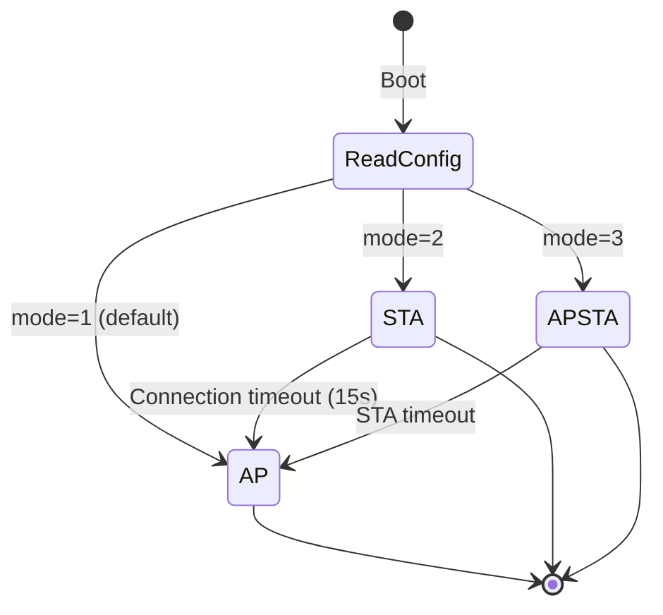
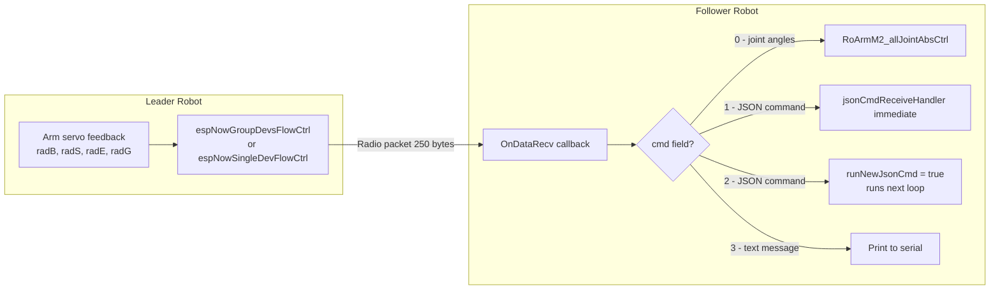
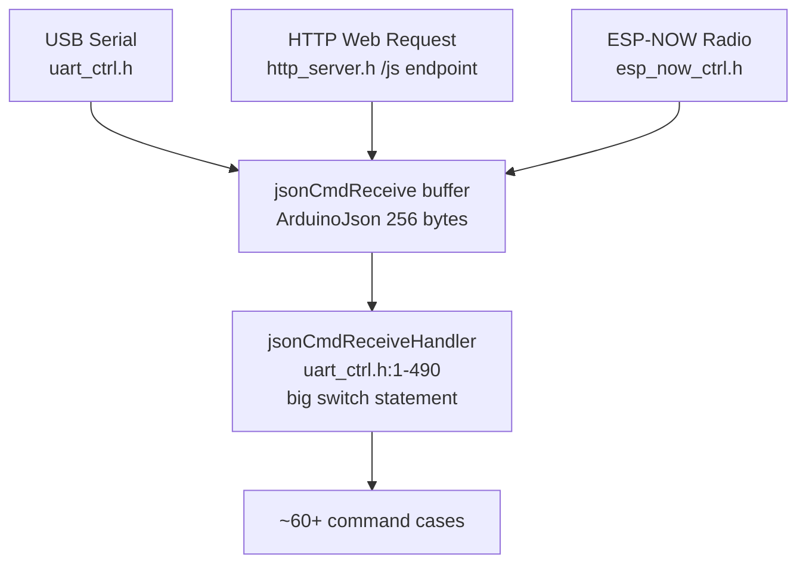
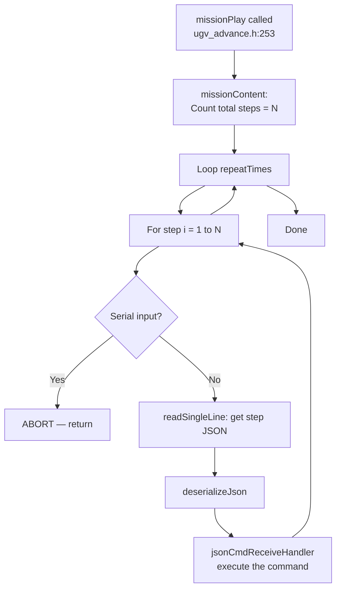
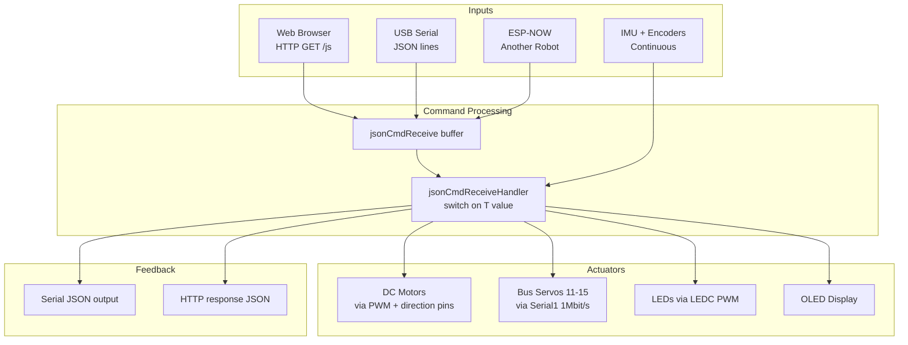

# Report 1: How the ESP32 UGV/RoArm System Works
### A Plain-English Guide with Code References and Diagrams

---

## What Is This Project?

This is the firmware (the software brain) for a small **robotic rover** built around an **ESP32** microcontroller chip. Think of the ESP32 as a tiny, cheap computer about the size of a thumb drive. It runs C++ code, connects to WiFi, and controls motors, robotic arms, and sensors — all at the same time.

The robot can be one of three physical variants:
- **WAVE ROVER** — a flat wheeled rover (mainType = 1)
- **UGV02** — a larger rover (mainType = 2)
- **UGV01** — a heavy-duty rover (mainType = 3)

And it can carry one of three "modules" on top:
- **Nothing** (moduleType = 0)
- **RoArm-M2** — a 4-joint robot arm (moduleType = 1)
- **Gimbal** — a pan/tilt camera mount (moduleType = 2)

---

## Big Picture: How the Code Is Organised

Instead of one giant file, the code is split into many `.h` "header" files, each responsible for one job. They are all stitched together in the main file `General_Driver.ino`.

```mermaid
graph TD
    A[General_Driver.ino<br/>Main entry point] --> B[ugv_config.h<br/>All settings & pin numbers]
    A --> C[movtion_module.h<br/>Wheels & motors]
    A --> D[RoArm-M2_module.h<br/>Robot arm maths & control]
    A --> E[gimbal_module.h<br/>Pan/tilt camera]
    A --> F[IMU_ctrl.h<br/>Balance sensor]
    A --> G[wifi_ctrl.h<br/>WiFi connection]
    A --> H[http_server.h<br/>Web control page]
    A --> I[esp_now_ctrl.h<br/>Radio link between robots]
    A --> J[uart_ctrl.h<br/>USB/serial commands]
    A --> K[ugv_advance.h<br/>Missions & scripting]
    A --> L[files_ctrl.h<br/>File storage on chip]
    A --> M[battery_ctrl.h<br/>Battery monitor]
    A --> N[oled_ctrl.h<br/>Small screen]
    A --> O[ugv_led_ctrl.h<br/>LED lights]
```



---

## The Boot Sequence (Setup)

When the robot powers on, `setup()` in `General_Driver.ino` runs once, top to bottom. Here is what happens step by step:



`General_Driver.ino:100-228`

---

## The Main Loop (What Runs Forever)

After setup, `loop()` runs over and over, thousands of times per second:



`General_Driver.ino:231-267`

---

## Subsystem 1: Driving the Wheels (Motors)

### The Physical Setup

The robot has two brushed DC motors (left and right). Each motor is controlled by a **motor driver chip** that takes two signals:

1. **Direction pins** (AIN1/AIN2 for left, BIN1/BIN2 for right) — set HIGH or LOW to choose forward/reverse
2. **PWM pin** (PWMA/PWMB) — a rapidly flashing signal whose "on" duty determines speed (0 = stop, 255 = full speed)

```
ugv_config.h:251-256
#define PWMA 25     ← ESP32 GPIO 25 controls left motor speed
#define AIN2 17     ← direction pin
#define AIN1 21     ← direction pin
#define BIN1 22     ← right motor direction
#define BIN2 23     ← right motor direction
#define PWMB 26     ← ESP32 GPIO 26 controls right motor speed
```

### Wheel Encoders

Each wheel has an **optical encoder** — a disc with slots that a light shines through. Counting how many times the light flashes tells you how far the wheel has turned.

```
ugv_config.h:258-261
#define AENCA 35    ← left encoder signal A
#define AENCB 34    ← left encoder signal B
#define BENCB 16    ← right encoder signal A
#define BENCA 27    ← right encoder signal B
```

Speed is calculated by counting encoder pulses per unit time:

```
movtion_module.h:159
speedGetA = (plusesRate * (pulses_now - pulses_last)) / (time_elapsed_seconds)
```

`plusesRate` converts pulses to metres: `π × wheel_diameter / pulses_per_revolution`

### PID Speed Control (Only for UGV01 / mainType 3)

For the heaviest robot variant, the code runs a **PID controller** — an algorithm that continuously compares the desired speed to the actual measured speed and adjusts the motor PWM to close the gap.



`movtion_module.h:348-361`

For simpler rovers (WAVE ROVER, UGV02), the speed command is scaled directly to PWM: `input × 512 × speed_rate`. `movtion_module.h:319`

### Heartbeat Watchdog

If no driving command is received for 3 seconds (configurable), the robot automatically stops. This prevents runaway if the remote control disconnects.

`movtion_module.h:393-402`

---

## Subsystem 2: The Robot Arm (RoArm-M2)

### What Are "Bus Servos"?

Unlike simple servos that just receive a pulse width signal, **bus servos** (made by Feetech, model SMS/STS series) communicate over a single wire using a protocol similar to RS-485. Each servo has a unique ID (11–15) and can report back its position, speed, load, temperature, and voltage.

```
Servo IDs (ugv_config.h:72-76):
 11 = BASE     (rotates the whole arm left/right)
 12 = SHOULDER_DRIVING  (lifts the arm up/down, main motor)
 13 = SHOULDER_DRIVEN   (mirrors servo 12, for extra torque)
 14 = ELBOW    (bends the forearm)
 15 = GRIPPER  (opens/closes the hand)
```

Communication happens on Serial1 at 1,000,000 bits/second on GPIO 18 (RX) and 19 (TX).

```
RoArm-M2_module.h:169-173
Serial1.begin(1000000, SERIAL_8N1, S_RXD, S_TXD);
st.pSerial = &Serial1;
```

### Servo Position Scale

Each servo position is a number from 0 to 4095 (12 bits). The middle position is 2047 (straight). This maps to 0–360 degrees.

```
ARM_SERVO_POS_RANGE = 4096  (total steps)
ARM_SERVO_MIDDLE_POS = 2047  (middle = 180°)
```

### Forward Kinematics — "Where is the hand?"

Given the angles of all joints, the code calculates the X/Y/Z position of the gripper tip in 3D space using trigonometry. The arm structure looks like this (from the side):

```
                  ┌──── L3 ────────────────O══L2B═══
                  │                        ^        ║
                 L3B                       │        ║
                  │                  ELBOW (14)    L2A
            END EFFECTOR                            ║
                                                    ║
                                    SHOULDER (12/13)║
                                                   [║]
                                                    L1
                                                   [║]
                                     BASE (11) ──> XX
```

`RoArm-M2_module.h:520-560`

The result is stored in `lastX`, `lastY`, `lastZ` (in millimetres from the base).

### Inverse Kinematics — "How do I reach a point?"

Given a target X/Y/Z/T (position + tool angle), the code works backwards to find what angles each joint must be at. This uses a **2-link planar IK** formula called `simpleLinkageIkRad`.



`RoArm-M2_module.h:647-683`

If the target is unreachable (e.g., too far away), `nanIK = true` and the arm stays at its last valid position.

### Smooth Path Interpolation (Bézier-like)

Instead of snapping directly to a target, the arm moves along a smooth S-curve path using `besselCtrl`:

```
output = (end - start) × ((cos(t×π + π) + 1) / 2) + start
```

This is a cosine easing function — slow at start, fast in the middle, slow at end. The loop steps `t` from 0.0 to 1.0 in small increments, calling `RoArmM2_goalPosMove()` and `delay(2)` at each step.

`RoArm-M2_module.h:810-853` — **this loop is blocking** (see Bug Report).

---

## Subsystem 3: The IMU (Balance/Orientation Sensor)

The IMU (Inertial Measurement Unit) is a combination of three chips on the I2C bus:

| Chip | Measures | I2C Address |
|------|----------|-------------|
| QMI8658 | Acceleration (3 axes) + Gyroscope (3 axes) | 0x6B |
| AK09918 | Magnetic field (3 axes, like a compass) | 0x0C |

These are fused together using an **AHRS algorithm** (Attitude and Heading Reference System) that combines all six/nine axes into three human-readable angles:

- **Roll** — tilt left/right
- **Pitch** — tilt forward/backward
- **Yaw** — rotation (compass heading)

`IMU_ctrl.h:16-36`

The IMU data feeds directly into:
1. **Gimbal stabilisation** — keeping a camera level even when the robot tilts
2. **Base feedback stream** — sent to any connected controller

---

## Subsystem 4: WiFi & Web Interface

### WiFi Modes



`wifi_ctrl.h:326-349`

Default credentials: SSID `"UGV"`, password `"12345678"`. `wifi_ctrl.h:23`

### Web Control Page

Connecting to the robot's IP on port 80 loads a web page (`web_page.h` — 1034 lines of embedded HTML/CSS/JavaScript). The page shows:
- Battery voltage, WiFi signal strength
- IMU roll/pitch/yaw angles
- 8-directional drive buttons (also keyboard WASD/arrows)
- Gimbal directional controls
- Speed selection (SLOW/MIDDLE/FAST)
- A JSON command text box for advanced control

Web commands are sent as HTTP GET requests to `/js?{"T":1,"L":0.5,"R":0.5}`.

`http_server.h:10-27`

---

## Subsystem 5: ESP-NOW (Radio Control Between Robots)

ESP-NOW is a proprietary WiFi-based protocol that lets two ESP32 devices talk directly without needing a router. It is used here to let one robot arm (the "leader") control one or more follower robots.



`esp_now_ctrl.h:118-170`

The data packet is a C struct (fixed 222 bytes):

```c
struct_message {
  byte  devCode;       // device selector
  float base;          // base joint angle (radians)
  float shoulder;      // shoulder angle
  float elbow;         // elbow angle
  float hand;          // gripper angle
  byte  cmd;           // command type (0-3)
  char  message[210];  // text/JSON payload
}
```

`esp_now_ctrl.h:3-11`

---

## Subsystem 6: JSON Command System

Every control action uses **JSON** — a human-readable data format. Every command has a `"T"` field (Type number) that tells the system what to do. Commands arrive via three channels, all feeding the same handler:



Example commands:

| Command | JSON | What It Does |
|---------|------|--------------|
| Drive | `{"T":1,"L":0.5,"R":0.5}` | Set left and right wheel speed (−1.0 to 1.0) |
| Raw PWM | `{"T":11,"L":164,"R":164}` | Direct PWM to motors (−255 to 255) |
| Move arm to XYZ | `{"T":104,"x":235,"y":0,"z":234,"t":3.14,"spd":0.25}` | Arm end-effector goal position |
| LED brightness | `{"T":132,"IO4":255,"IO5":255}` | Set LED PWM on GPIO 4 and 5 |
| Reboot | `{"T":600}` | Restart the ESP32 |
| Play mission | `{"T":242,"name":"boot","times":1}` | Execute a saved script |

---

## Subsystem 7: Mission/Script System

The robot can record and replay sequences of moves stored as text files in flash memory. Think of it like a simple macro recorder.

### File Structure

A `.mission` file on the flash filesystem looks like:
```
{"name":"mission_a","intro":"test mission"}
{"T":104,"x":235,"y":0,"z":234,"t":3.14,"spd":0.25}
{"T":111,"cmd":2000}
{"T":104,"x":200,"y":50,"z":200,"t":2.5,"spd":0.25}
```
- Line 1: mission metadata
- Lines 2+: one JSON command per line (each is a step)

### Mission Execution Flow



`ugv_advance.h:253-274`

The **boot** mission runs automatically on every startup (`General_Driver.ino:227`), which is how settings like PID parameters or speed rates can be auto-applied.

---

## Subsystem 8: Battery Monitoring

An **INA219** chip (connected via I2C) measures the battery voltage and current draw. The values are exposed in the base feedback stream as `"v"` (voltage in volts).

`battery_ctrl.h` / `General_Driver.ino:105-106`

---

## Subsystem 9: OLED Display

A small SSD1306 OLED screen (I2C, 4 lines of text) shows status during boot and runtime. Lines are updated via `oled_update()` which writes `screenLine_0` through `screenLine_3`.

`oled_ctrl.h`

---

## Complete Data Flow Summary



---

*End of Report 1.*
