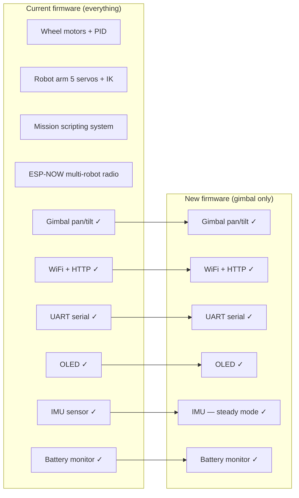
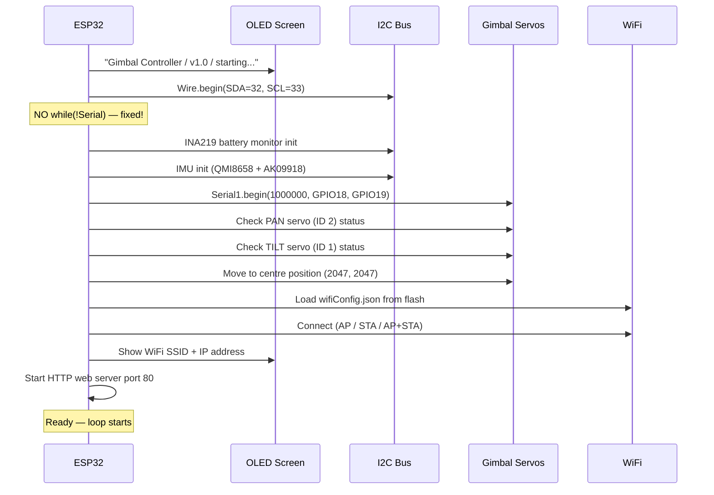
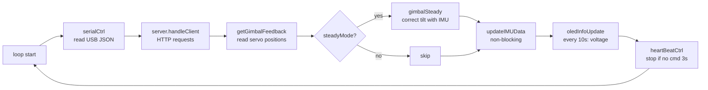
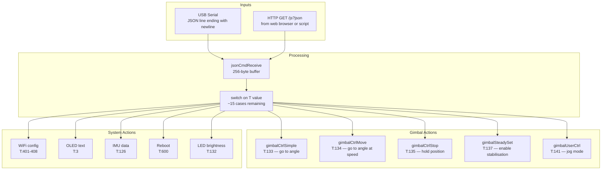
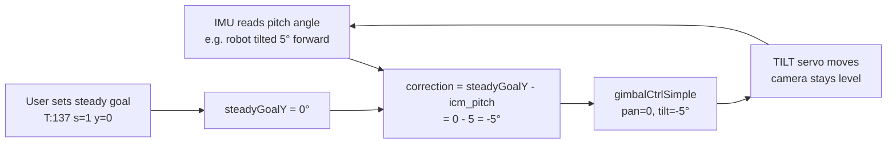
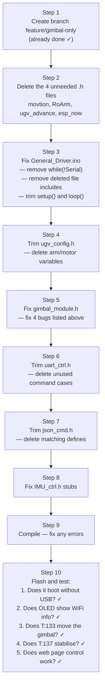
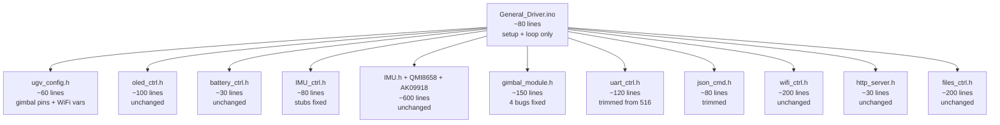

# Report 4: Gimbal-Only Firmware — Plan & Architecture

**Branch:** `feature/gimbal-only`

---

## Goal in Plain English

Strip the firmware down to only what is needed to control a pan/tilt gimbal.
Everything else — the robot arm, the wheel motors, the ESP-NOW radio, the mission
scripting system — gets deleted. The result is a smaller, simpler, more reliable
program that:

1. Accepts gimbal pan/tilt commands over **USB serial** (JSON)
2. Accepts gimbal commands over **WiFi HTTP** (JSON, web page)
3. Shows **WiFi info and voltage** on the OLED screen
4. Uses the **IMU** sensor for optional gimbal stabilisation (keep the camera level)
5. Has **no blocking code** — every subsystem stays responsive at all times

---

## Current State vs Target State



---

## Part 1 — Files to DELETE Completely

These files are only used by the arm, motors, missions, or ESP-NOW.
Once deleted, their code is gone and does not need to be touched elsewhere.

| File | Why it can be deleted |
|------|----------------------|
| `movtion_module.h` | All wheel motor control, PID, encoder reading |
| `RoArm-M2_module.h` | Entire robot arm: IK, servo maths, joint control |
| `ugv_advance.h` | Mission scripting, file-based step playback, arm macros |
| `esp_now_ctrl.h` | Multi-robot radio — not needed for gimbal-only |
| `ugv_led_ctrl.h` | LED PWM on IO4/IO5 — optional, not core functionality |
| `SCServo/` (library) | **Keep** — gimbal still uses SMS_STS bus servos |

> Nothing in `SCServo/` gets deleted. The gimbal and arm use the same servo
> hardware; we are just removing the arm's control code, not the servo library.

---

## Part 2 — Files to KEEP Unchanged

These files need zero modification:

| File | Reason to keep |
|------|---------------|
| `oled_ctrl.h` | OLED display — works fine, keep as-is |
| `battery_ctrl.h` | INA219 voltage monitor — feeds OLED, keep as-is |
| `http_server.h` | HTTP web server — keep as-is |
| `web_page.h` | Embedded web page HTML — keep as-is |
| `wifi_ctrl.h` | WiFi AP/STA/APSTA — keep as-is |
| `files_ctrl.h` | LittleFS file read/write — needed for wifiConfig.json |
| `IMU.h / IMU.cpp` | IMU fusion algorithm |
| `QMI8658.h/cpp` | Gyroscope/accelerometer chip driver |
| `AK09918.h/cpp` | Magnetometer chip driver |

---

## Part 3 — Files to CHANGE

### 3a. `General_Driver.ino` — Major Rewrite

**Remove:**
- All `#include` lines for deleted files
- All `Adafruit_ICM20X` / `Adafruit_ICM20948` includes (not used)
- `ESP32Encoder` include (encoders are for wheels)
- `PID_v2` include (PID is for wheels)
- `SimpleKalmanFilter` include (used by motors)
- `nvs_flash.h` duplicate include
- `moduleType_RoArmM2()` function
- All motor/encoder/PID variable declarations in `ugv_config.h` references
- `initEncoders()` call
- `pidControllerInit()` call
- `getLeftSpeed()` / `getRightSpeed()` / PID compute calls in loop
- The `createMission` / `missionPlay` boot mission calls
- The `led_pin_init()` call (if LED file removed)

**Fix:**
- Remove `while(!Serial) {}` on line 103 — **this is the critical fix that makes GPIO 18/19 work**
- Set `mainType = 1` and `moduleType = 2` as the only valid configuration

**Keep:**
- `setup()` structure (trimmed)
- `loop()` structure (trimmed)
- `server.handleClient()`
- `serialCtrl()`
- `moduleType_Gimbal()` call
- `oledInfoUpdate()`
- `updateIMUData()`
- `heartBeatCtrl()`

---

### 3b. `ugv_config.h` — Trim Settings

**Remove all of these variable/define blocks:**

| Block | Lines (approx) | Reason |
|-------|----------------|--------|
| All arm servo IDs and positions | 72–83 | No arm |
| All arm link length variables (L1, L2, L3…) | 85–163 | No IK |
| All arm joint angle/rad variables | 199–242 | No arm |
| All motor pin defines (PWMA/PWMB/AIN/BIN) | 251–266 | No motors |
| Motor frequency/channel variables | 264–266 | No motors |
| Bus servo PID address defines | 270–280 | No arm PID writes |
| PID controller variables (__kp, __ki…) | 317–319 | No motor PID |
| Wheel parameters (WHEEL_D etc.) | 345–348 | No wheels |
| Encoder pin defines (AENCA/B, BENCA/B) | 258–261 | No encoders |
| `baseFeedbackFlow` variable | 51 | No base feedback |
| ESP-NOW mode variable | 14–16 | No ESP-NOW |
| Broadcast MAC/whitelist | 24–25 | No ESP-NOW |
| `runNewJsonCmd` flag | 33 | No ESP-NOW |
| `BASE_JOINT` / `SHOULDER_JOINT` defines | 55–58 | No arm |

**Keep:**
- `InfoPrint`, `mainType`, `moduleType`
- `steadyMode`, `steadyGoalY`
- `S_SCL`, `S_SDA` (I2C for OLED + IMU)
- `S_RXD`, `S_TXD` (GPIO 18/19 for servo bus)
- `GIMBAL_PAN_ID`, `GIMBAL_TILT_ID`
- `SERVO_STOP_DELAY`, `HEART_BEAT_DELAY`
- `IO4_PIN`, `IO5_PIN` (keep if LEDs stay)
- `FREQ`, `ANALOG_WRITE_BITS` (for LEDC)
- `last_imu_update`, `icm_pitch/roll/yaw`

---

### 3c. `gimbal_module.h` — Fix 4 Bugs

**Bug Fix 1 — Wrong array on servo failure** (`Bug #19` from Report 2):

```cpp
// BROKEN (current code):
} else {
    servoFeedback[0].status = false;  // wrong array!

// FIXED:
} else {
    gimbalFeedback[0].status = false;  // correct array
```

Same fix needed for TILT servo failure path.

**Bug Fix 2 — `gimbalCtrlStop()` doesn't actually stop** (`Bug #18`):

```cpp
// BROKEN (current code) — releases torque for 3ms then re-enables:
void gimbalCtrlStop() {
    st.EnableTorque(GIMBAL_PAN_ID, 0);
    st.EnableTorque(GIMBAL_TILT_ID, 0);
    delay(SERVO_STOP_DELAY);
    st.EnableTorque(GIMBAL_PAN_ID, 1);
    st.EnableTorque(GIMBAL_TILT_ID, 1);
}

// FIXED — hold current position by writing current pos as goal:
void gimbalCtrlStop() {
    getGimbalFeedback();
    gimbalPos[0] = gimbalFeedback[0].pos;
    gimbalPos[1] = gimbalFeedback[1].pos;
    gimbalSpd[0] = 0;
    gimbalSpd[1] = 0;
    gimbalAcc[0] = 0;
    gimbalAcc[1] = 0;
    st.SyncWritePosEx(gimbalID, 2, gimbalPos, gimbalSpd, gimbalAcc);
}
```

**Bug Fix 3 — Blocking `delay()` in `gimbalUserCtrl()`** (`Bug #17`):

```cpp
// BROKEN — delay(5) blocks the entire loop:
servoTorqueCtrl(GIMBAL_PAN_ID, 0);
delay(5);
servoTorqueCtrl(GIMBAL_PAN_ID, 1);

// FIXED — record current position without toggling torque:
getGimbalFeedback();
goalX = panAngleCompute(gimbalFeedback[0].pos);
// (remove the torque toggle entirely)
```

**Bug Fix 4 — `gimbalCtrlSimple()` map() formula is wrong**:

```cpp
// BROKEN — maps 0→360 range but input is -180→+180:
gimbalPos[0] = 2047 + (int)round(map(Xinput, 0, 360, 0, 4095));

// FIXED — correct mapping for signed angle input:
gimbalPos[0] = 2047 + (int)round(map(Xinput, -180, 180, -2047, 2047));
gimbalPos[1] = 2047 - (int)round(map(Yinput, -30, 90, -341, 1024));
```

---

### 3d. `uart_ctrl.h` — Remove Unused Command Cases

Delete all `case` blocks for commands that no longer exist:
- All arm commands: `CMD_MOVE_INIT`, `CMD_SINGLE_JOINT_CTRL`, `CMD_JOINTS_RAD_CTRL`, `CMD_XYZT_GOAL_CTRL`, etc. (T:100–125, T:210–231, T:241–242)
- All motor commands: `CMD_SPEED_CTRL`, `CMD_PWM_INPUT`, `CMD_ROS_CTRL`, `CMD_SET_MOTOR_PID` (T:1, T:2, T:11, T:13)
- All ESP-NOW commands: T:300–306
- All mission commands: T:220–242
- `CMD_ARM_CTRL_UI` (T:144)
- `CMD_SET_SERVO_ID`, `CMD_SET_MIDDLE`, `CMD_SET_SERVO_PID` (T:501–503) — arm-specific

**Keep** these command cases:
- `CMD_OLED_CTRL` (T:3), `CMD_OLED_DEFAULT` (T:-3)
- `CMD_GET_IMU_DATA` (T:126), `CMD_CALI_IMU_STEP` (T:127)
- `CMD_BASE_FEEDBACK` (T:130), `CMD_BASE_FEEDBACK_FLOW` (T:131)
- `CMD_FEEDBACK_FLOW_INTERVAL` (T:142), `CMD_UART_ECHO_MODE` (T:143)
- `CMD_LED_CTRL` (T:132)
- `CMD_GIMBAL_CTRL_SIMPLE` (T:133)
- `CMD_GIMBAL_CTRL_MOVE` (T:134)
- `CMD_GIMBAL_CTRL_STOP` (T:135)
- `CMD_HEART_BEAT_SET` (T:136)
- `CMD_GIMBAL_STEADY` (T:137)
- `CMD_GIMBAL_USER_CTRL` (T:141)
- `CMD_WIFI_ON_BOOT` (T:401), `CMD_SET_AP` (T:402), `CMD_SET_STA` (T:403)
- `CMD_WIFI_APSTA` (T:404), `CMD_WIFI_INFO` (T:405), `CMD_WIFI_STOP` (T:408)
- `CMD_REBOOT` (T:600), `CMD_FREE_FLASH_SPACE` (T:601)
- `CMD_NVS_CLEAR` (T:604), `CMD_INFO_PRINT` (T:605)
- `CMD_SCAN_FILES` (T:200), `CMD_CREATE_FILE` (T:201), `CMD_READ_FILE` (T:202), `CMD_DELETE_FILE` (T:203)

---

### 3e. `json_cmd.h` — Remove Unused Defines

Delete all `#define` entries for commands that have been removed from `uart_ctrl.h`.
Keep only the defines that match the cases listed above.

---

### 3f. `IMU_ctrl.h` — Implement Stubs

The three empty functions should either be implemented or clearly marked as not-yet-implemented so they do not silently succeed:

```cpp
// Currently EMPTY — add at minimum a Serial response:
void imuCalibration() {
    Serial.println("{\"info\":\"IMU calibration not implemented\"}");
}

void getIMUOffset() {
    Serial.println("{\"info\":\"IMU offset get not implemented\"}");
}

void setIMUOffset(int16_t x, int16_t y, int16_t z) {
    Serial.println("{\"info\":\"IMU offset set not implemented\"}");
}
```

---

## Part 4 — Critical Bug to Fix: `while(!Serial)`

This single fix makes GPIO 18/19 (the servo bus) work when the robot runs on battery:

**File:** `General_Driver.ino` line 103

```cpp
// BEFORE (broken — hangs forever without USB cable):
Serial.begin(115200);
Wire.begin(S_SDA, S_SCL);
while(!Serial) {}         // ← DELETE THIS LINE

// AFTER (fixed):
Serial.begin(115200);
Wire.begin(S_SDA, S_SCL);
// no blocking wait — Serial works fine without it on ESP32
```

Without this fix, `RoArmM2_servoInit()` (renamed to `gimbalServoInit()` in the new
code) is never called, meaning `Serial1.begin()` on GPIO 18/19 never runs, meaning
the pan and tilt servos never respond.

---

## Part 5 — How the New Code Flows

### New Setup Sequence



### New Loop — Non-Blocking



**Every function in this loop returns quickly — no `delay()`, no `while()` loops.**

### Command Flow



### Gimbal Stabilisation Loop



---

## Part 6 — File Summary Table

| File | Action | Why |
|------|--------|-----|
| `General_Driver.ino` | ✏️ Rewrite | Remove all arm/motor/ESP-NOW calls, fix `while(!Serial)` |
| `ugv_config.h` | ✏️ Trim | Remove ~200 lines of arm/motor config |
| `gimbal_module.h` | ✏️ Fix bugs | 4 bugs: wrong array, bad stop, blocking delay, wrong map |
| `uart_ctrl.h` | ✏️ Trim | Keep ~15 command cases, delete ~50 |
| `json_cmd.h` | ✏️ Trim | Delete defines for removed commands |
| `IMU_ctrl.h` | ✏️ Stub fix | Add error responses to empty functions |
| `oled_ctrl.h` | ✅ Keep as-is | Works correctly |
| `battery_ctrl.h` | ✅ Keep as-is | Works correctly |
| `wifi_ctrl.h` | ✅ Keep as-is | Works correctly |
| `http_server.h` | ✅ Keep as-is | Works correctly |
| `web_page.h` | ✅ Keep as-is | Web interface works |
| `files_ctrl.h` | ✅ Keep as-is | Needed for wifiConfig.json |
| `IMU.h / .cpp` | ✅ Keep as-is | Sensor fusion |
| `QMI8658.h/cpp` | ✅ Keep as-is | Gyro/accel driver |
| `AK09918.h/cpp` | ✅ Keep as-is | Magnetometer driver |
| `movtion_module.h` | ❌ Delete | Motors, wheels, PID |
| `RoArm-M2_module.h` | ❌ Delete | Robot arm |
| `ugv_advance.h` | ❌ Delete | Mission scripting |
| `esp_now_ctrl.h` | ❌ Delete | Multi-robot radio |
| `ugv_led_ctrl.h` | ❌ Delete (optional) | LED PWM (keep if LEDs needed) |

---

## Part 7 — Commands That Will Still Work After the Refactor

| JSON Command | What It Does |
|-------------|-------------|
| `{"T":133,"X":45,"Y":20,"SPD":300,"ACC":0}` | Move gimbal to pan=45°, tilt=20° |
| `{"T":134,"X":45,"Y":20,"SX":300,"SY":300}` | Move gimbal smoothly to angle |
| `{"T":135}` | Stop gimbal, hold current position |
| `{"T":137,"s":1,"y":0}` | Enable stabilisation, goal tilt = 0° |
| `{"T":137,"s":0,"y":0}` | Disable stabilisation |
| `{"T":141,"X":1,"Y":0,"SPD":300}` | Jog pan right |
| `{"T":141,"X":0,"Y":1,"SPD":300}` | Jog tilt up |
| `{"T":141,"X":2,"Y":2,"SPD":0}` | Centre gimbal |
| `{"T":126}` | Get IMU roll/pitch/yaw |
| `{"T":132,"IO4":255,"IO5":0}` | LED brightness |
| `{"T":3,"lineNum":0,"Text":"Hello"}` | Write text to OLED |
| `{"T":403,"ssid":"MyWiFi","password":"pass"}` | Connect to WiFi |
| `{"T":405}` | Get WiFi info (IP, RSSI) |
| `{"T":600}` | Reboot |

---

## Part 8 — Step-by-Step Implementation Order

Do these in order. Each step can be tested independently before moving to the next.



---

## Part 9 — What the New Codebase Looks Like

### Before (current): ~3,500 lines across 20+ files

### After (gimbal-only): ~800 lines across 12 files



---

*End of Report 4.*
