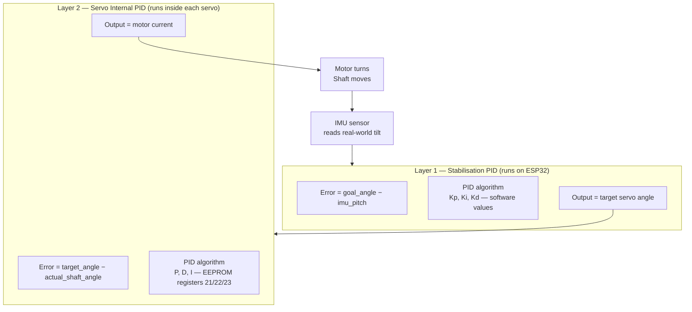
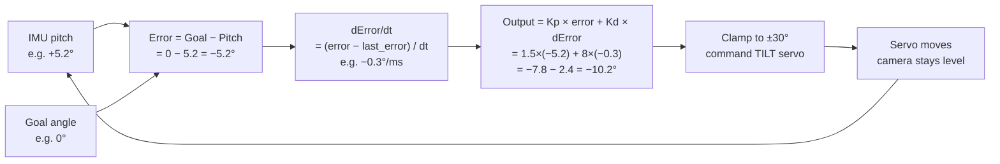
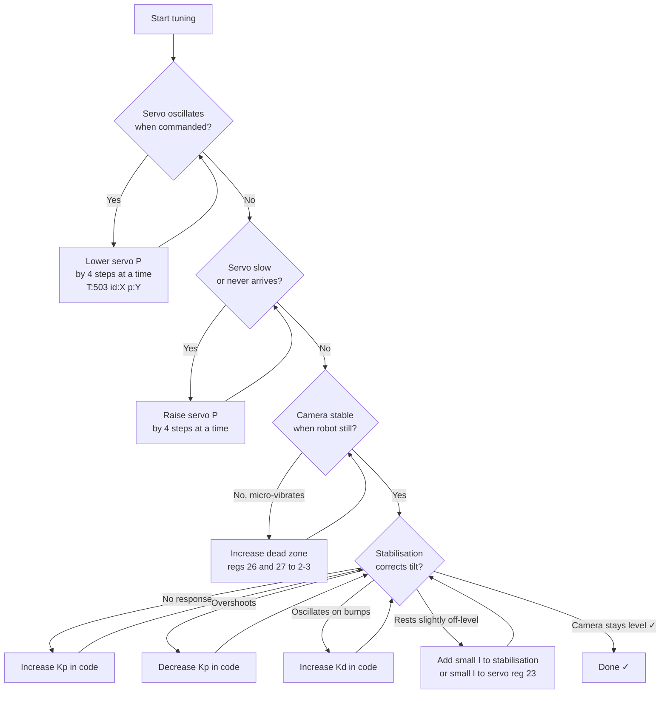
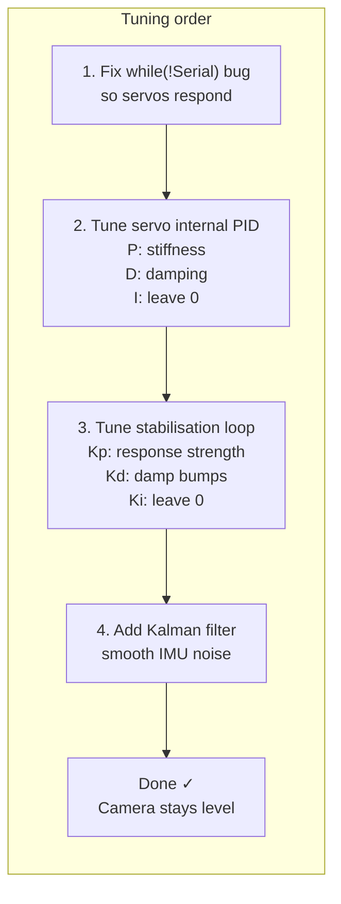

# Report 5: Gimbal PID Tuning — Complete Guide

---

## Overview: Two Layers of PID

Before anything else, understand that this gimbal system has **two completely separate PID controllers** stacked on top of each other:



| Layer | Where it runs | What it controls | How to tune |
|-------|--------------|-----------------|-------------|
| **Stabilisation PID** | ESP32 software | Which angle to command based on robot tilt | Edit code variables, re-flash |
| **Servo internal PID** | Inside each servo chip | How fast/precisely the motor reaches the commanded angle | Send JSON commands over USB/WiFi |

**You must tune Layer 2 first** — if the servo can't hold a position accurately, Layer 1 has nothing reliable to work with.

---

## Part 1 — The Servo Internal PID (Layer 2)

### Yes — PAN and TILT Can Have Completely Independent PIDs

Every servo on the bus has its own EEPROM. PAN (ID 2) and TILT (ID 1) are separate servos with separate memory. You write to a specific servo ID, so the gains are fully independent.

```
PAN  servo (ID 2): P=32, D=32, I=0  ← default from factory
TILT servo (ID 1): P=32, D=32, I=0  ← default from factory
```

You can set them to completely different values — for example a looser PAN and a stiffer TILT.

---

### The Servo Internal PID Register Table

| Address | Name | Default | Range | What it does |
|---------|------|---------|-------|-------------|
| **21** | P Coefficient | **32** | 0–255 | Proportional — how hard it pushes toward target |
| **22** | D Coefficient | **32** | 0–255 | Derivative — damping, resists fast movement |
| **23** | I Coefficient | **0** | 0–255 | Integral — corrects persistent error |

These live in **EEPROM** — they survive power off. Changing them requires unlocking the EEPROM first.

Also relevant to tuning:

| Address | Name | Default | Range | Relevance |
|---------|------|---------|-------|-----------|
| 26 | CW Dead Zone | 1 | 0–255 | Steps of position error ignored clockwise |
| 27 | CCW Dead Zone | 1 | 0–255 | Steps of position error ignored counter-clockwise |
| 41 | Acceleration | 0 | 0–254 | Soft ramp — 0 = instant, higher = smoother start |
| 48/49 | Torque Limit | 1000 | 0–1000 | Max holding force (100% = 1000) |

---

### What Each Gain Does — Visually

#### Effect of P (Proportional)

```
P too LOW:
  Target ──────────────────────────────── ─ ─ ─
  Actual ──────────────/                (never arrives)
                                            slow, weak

P correct:
  Target ──────────────────────────────────────
  Actual ──────────────/‾‾‾‾‾‾‾‾‾‾‾‾‾‾‾‾‾‾‾‾‾
                       smooth arrival, holds tight

P too HIGH:
  Target ──────────────────────────────────────
  Actual ──────────────/‾\/‾\/‾\/‾\──────────
                       overshoots and oscillates
```

#### Effect of D (Derivative)

```
D too LOW (with high P):
  Target ──────────────────────────────────────
  Actual ──────────────/‾\/‾\/‾\/‾\──────────
                       oscillates, never settles

D correct:
  Target ──────────────────────────────────────
  Actual ────────────────/‾‾‾‾‾────────────────
                         overshoots once, settles

D too HIGH:
  Target ──────────────────────────────────────
  Actual ─────────────────────────/‾‾‾‾────────
                                  sluggish, slow
```

#### Effect of I (Integral)

```
Without I (I=0):
  Target ──────────────────────────────────────
  Actual ─────────────────/‾‾‾‾‾‾‾ ─ ─ ─ ─ ─
                          Small gap remains (static error)

With small I (I=5):
  Target ──────────────────────────────────────
  Actual ─────────────────/‾‾‾‾‾‾‾‾‾‾‾‾‾‾────
                          Slowly closes the gap
```

For a gimbal, **I is almost always left at 0**. Static error in a gimbal means the camera is permanently off-level by a tiny fixed amount, which can be corrected in the stabilisation layer instead. Adding I to the servo risks slow oscillation (integral windup).

---

### The Communication Protocol

Understanding the protocol helps you know exactly what happens when you send a PID change command.

#### Physical Layer

```
Single wire, half-duplex, UART 1,000,000 baud
8 data bits, 1 stop bit, no parity
All servos share one wire — ESP32 transmits then listens for reply
```

#### Packet Structure — Instruction (ESP32 → Servo)

```
Byte 0:  0xFF        ← header byte 1 (always)
Byte 1:  0xFF        ← header byte 2 (always)
Byte 2:  ID          ← servo ID (1-253), 0xFE = broadcast all
Byte 3:  LENGTH      ← number of bytes from here to checksum (excl. header+ID)
Byte 4:  INSTRUCTION ← what to do (see table below)
Byte 5…: PARAMETERS  ← depends on instruction
Last:    CHECKSUM    ← ~(ID + LENGTH + INSTRUCTION + all PARAMS) & 0xFF
```

Visual packet layout:

```
┌──────┬──────┬────┬────────┬─────────────┬───────────────────────┬──────────┐
│ 0xFF │ 0xFF │ ID │ LENGTH │ INSTRUCTION │ PARAMETERS (variable) │ CHECKSUM │
└──────┴──────┴────┴────────┴─────────────┴───────────────────────┴──────────┘
  [0]    [1]   [2]    [3]        [4]            [5 … N-1]              [N]
```

#### Instruction Codes

| Code | Hex | Name | What it does |
|------|-----|------|-------------|
| `INST_PING` | `0x01` | Ping | Check if a servo with given ID is alive |
| `INST_READ` | `0x02` | Read | Read N bytes from a register address |
| `INST_WRITE` | `0x03` | Write | Write bytes to register — immediate effect |
| `INST_REG_WRITE` | `0x04` | Async Write | Buffer a write — waits for ACTION command |
| `INST_REG_ACTION` | `0x05` | Action | Execute all buffered REG_WRITE commands simultaneously |
| `INST_SYNC_READ` | `0x82` | Sync Read | Read same register from multiple servos |
| `INST_SYNC_WRITE` | `0x83` | Sync Write | Write to multiple servos in one packet |

The broadcast ID `0xFE` sends to all servos but **no reply is sent back**. Individual IDs get a reply (acknowledgement packet).

#### Checksum Calculation

```
checksum = ~(ID + LENGTH + INSTRUCTION + PARAM_1 + PARAM_2 + ... + PARAM_N)
           └─────────────────────────────────────────────────────────────────┘
                              sum all these bytes, then bitwise NOT
           If sum > 255, take only the lowest byte (automatic in uint8_t)
```

Example — Write P=20 to TILT servo (ID=1, address 21):

```
ID     = 1
LENGTH = 4    (INST + ADDR + VALUE + checksum overhead = 1+1+1+1)
INST   = 0x03 (WRITE)
ADDR   = 21   (0x15 — P coefficient register)
VALUE  = 20   (0x14)

Sum    = 1 + 4 + 3 + 21 + 20 = 49
~49    = 0b11001110 = 206 = 0xCE

Full packet: FF FF 01 04 03 15 14 CE
```

#### Reply Packet (Servo → ESP32)

```
┌──────┬──────┬────┬────┬───────┬──────────┐
│ 0xFF │ 0xFF │ ID │ 02 │ ERROR │ CHECKSUM │
└──────┴──────┴────┴────┴───────┴──────────┘
```

The ERROR byte is a **bitmask**:

| Bit | Meaning |
|-----|---------|
| 0 | Voltage out of range |
| 1 | Angle out of limit |
| 2 | Overheating |
| 3 | Range error |
| 4 | Checksum error |
| 5 | Overload |
| 6 | Instruction error |

`ERROR = 0` means everything is fine.

#### EEPROM Write Sequence (required for PID registers)

Because PID registers 21/22/23 are in EEPROM, a specific sequence is needed:

```
Step 1: Write 0 to register 55 (LOCK) → unlocks EEPROM
Step 2: Write new PID value to register 21/22/23
Step 3: Write 1 to register 55 (LOCK) → locks EEPROM again
```

The SCServo library wraps this as `st.unLockEprom(ID)` / `st.LockEprom(ID)`.

---

## Part 2 — The Stabilisation PID (Layer 1)

This runs on the ESP32 itself. It reads the IMU pitch/roll every loop iteration and commands the servo to an angle that compensates for the robot's tilt.

### Current Code (P-only, broken)

```cpp
// gimbal_module.h:136-141
void gimbalSteady(float inputBiasY) {
  if (!steadyMode) { return; }
  gimbalCtrlSimple(0, inputBiasY - icm_pitch, 0, 0);
}
```

This is a **P controller with gain = 1.0** — it directly uses the tilt error as the commanded angle. Problems:
- Gain of 1.0 may not be right for this servo/gimbal mass
- No D term → oscillates when the robot moves
- No rate limiting → can command the servo faster than it can respond

### What It Should Look Like (PD stabilisation)



### Proposed Software PID Variables

```cpp
// In ugv_config.h (or gimbal_module.h) — gimbal stabilisation gains
float gimbal_Kp = 1.5;    // proportional — start here, tune up/down
float gimbal_Kd = 8.0;    // derivative — damps oscillation
float gimbal_Ki = 0.0;    // integral — leave 0 unless drift persists
float gimbal_max_output = 30.0;  // max correction angle in degrees
```

These are separate from the servo's internal P/D/I. The naming is different deliberately to avoid confusion.

---

## Part 3 — How to Use Them Right Now (Current Codebase)

### Reading Current Servo PID Values

Send this over USB serial or HTTP:

```json
{"T":108,"joint":4,"p":16,"i":0}
```

But there is no dedicated "read PID" command in the current codebase. To read the raw register you would need to add a command, or use the Arduino serial monitor manually. The existing `setServosPID` function (`RoArm-M2_module.h:199`) writes but never reads.

### Writing PID to PAN Servo (ID 2)

There is no direct JSON command for gimbal servo PID in the current firmware. The `CMD_SET_SERVO_PID` command (`T:503`) exists but calls `setServosPID()` which is in `RoArm-M2_module.h` — it will still work for any servo ID including gimbal servos. Send:

```json
{"T":503,"id":2,"p":20}
```

This sets **P=20** on PAN servo (ID 2). The function only sets P — D and I cannot be set via this command in the current code.

To set D and I you need to add new command handling (see Part 4).

### Writing PID to TILT Servo (ID 1)

```json
{"T":503,"id":1,"p":20}
```

### Enabling Stabilisation

```json
{"T":137,"s":1,"y":0}
```

`s=1` = steady mode on, `y=0` = goal tilt angle is 0° (camera stays level with ground).

### Disabling Stabilisation

```json
{"T":137,"s":0,"y":0}
```

### Checking It Is Working

Enable base feedback flow, which streams IMU angles:

```json
{"T":131,"cmd":1}
```

You will see lines like:
```json
{"T":1001,"L":0,"R":0,"r":1.2,"p":-3.4,"y":45.1,"temp":28.5,"v":7.8}
```

`"p"` is pitch. If stabilisation is working, the tilt servo should move opposite to pitch changes.

---

## Part 4 — Tuning Strategy Step by Step

### Phase 1: Tune the Servo Internal PID First (Layer 2)

**Goal:** servo should reach any commanded angle quickly, with minimal overshoot, and hold it firmly.

**Tools needed:** USB serial + any serial terminal (Arduino IDE monitor, PuTTY, etc.)

#### Step 1 — Get a baseline

Send the gimbal to centre:
```json
{"T":133,"X":0,"Y":0,"SPD":0,"ACC":0}
```

Then send it to +30°:
```json
{"T":133,"X":0,"Y":30,"SPD":500,"ACC":10}
```

Watch physically how it moves. Does it:
- Overshoot and bounce? → **P too high or D too low**
- Creep slowly and never arrive? → **P too low**
- Arrive perfectly and hold? → **already good, proceed**

#### Step 2 — Lower P if oscillating

```json
{"T":503,"id":1,"p":16}
```
Test again. Repeat until oscillation stops.

#### Step 3 — D is already 32 (factory default)

D=32 is generally good. If the servo still oscillates after lowering P, increase D:

```
D=32 default → try D=40 → D=50
```

Unfortunately the current JSON command `T:503` only sets P. You need to send raw bytes or add a new command (see below).

#### Step 4 — Leave I at 0

Only add I (e.g. I=3) if after tuning P and D the camera rests slightly off-level even with stabilisation off and the servo commanded to 0°.

#### Step 5 — Check Dead Zone (registers 26/27)

The factory dead zone is 1 step (≈ 0.088°). For a gimbal this is fine. If the camera micro-vibrates when at rest, increase dead zone to 2–3.

---

### Phase 2: Tune the Stabilisation Loop (Layer 2 → Layer 1)

**Goal:** when the robot tilts, the camera stays level with no oscillation.

#### Step 1 — Enable stabilisation, minimal Kp

In the current code, `gimbalSteady()` has no Kp variable — gain is always 1.0. Once the gimbal-only refactor is done (Report 4 plan), set:

```cpp
float gimbal_Kp = 0.8;
float gimbal_Kd = 0.0;
```

#### Step 2 — Tilt the robot slowly by hand

The camera should follow, correcting toward level. If it:
- Doesn't respond enough → increase Kp
- Overshoots → decrease Kp

#### Step 3 — Add Kd to damp fast movements

When the robot drives over a bump (fast tilt), the camera should not swing wildly. Increase Kd until fast disturbances are absorbed:

```cpp
float gimbal_Kd = 5.0;   // try this
float gimbal_Kd = 10.0;  // if still swinging
float gimbal_Kd = 15.0;  // max practical value
```

#### Step 4 — Add Kalman filter on IMU pitch (optional but recommended)

The IMU readings are noisy. Filtering before feeding into the stabilisation PID prevents the gimbal from buzzing:

```cpp
// Already included: SimpleKalmanFilter
SimpleKalmanFilter pitchFilter(0.1, 0.1, 0.01);
// In loop:
float filtered_pitch = pitchFilter.updateEstimate(icm_pitch);
// Use filtered_pitch instead of icm_pitch in gimbalSteady()
```

---

### Full Tuning Decision Tree



---

## Part 5 — What Needs to Be Added to the Code

The current codebase is missing commands to fully control gimbal servo PID. Here is what to add in the gimbal-only refactor:

### New command: Set Gimbal Servo P/D/I independently

Add to `json_cmd.h`:
```cpp
// {"T":150,"id":1,"p":20,"d":32,"i":0}
#define CMD_SET_GIMBAL_SERVO_PID  150
```

Add handler function to `gimbal_module.h`:
```cpp
void setGimbalServoPID(byte servoID, byte p_val, byte d_val, byte i_val) {
    st.unLockEprom(servoID);
    st.writeByte(servoID, 21, p_val);  // P
    st.writeByte(servoID, 22, d_val);  // D
    st.writeByte(servoID, 23, i_val);  // I
    st.LockEprom(servoID);
}
```

Add to `uart_ctrl.h` switch:
```cpp
case CMD_SET_GIMBAL_SERVO_PID:
    setGimbalServoPID(
        jsonCmdReceive["id"],
        jsonCmdReceive["p"],
        jsonCmdReceive["d"],
        jsonCmdReceive["i"]
    ); break;
```

### New command: Read Gimbal Servo PID

Add to `json_cmd.h`:
```cpp
// {"T":151,"id":1}
#define CMD_GET_GIMBAL_SERVO_PID  151
```

Add handler:
```cpp
void getGimbalServoPID(byte servoID) {
    st.unLockEprom(servoID);
    int p = st.readByte(servoID, 21);
    int d = st.readByte(servoID, 22);
    int i = st.readByte(servoID, 23);
    st.LockEprom(servoID);

    jsonInfoHttp.clear();
    jsonInfoHttp["T"]  = 151;
    jsonInfoHttp["id"] = servoID;
    jsonInfoHttp["p"]  = p;
    jsonInfoHttp["d"]  = d;
    jsonInfoHttp["i"]  = i;
    String s; serializeJson(jsonInfoHttp, s);
    Serial.println(s);
}
```

### New command: Set Stabilisation Gains

```cpp
// {"T":152,"kp":1.5,"kd":8.0,"ki":0.0}
#define CMD_SET_STAB_PID  152
```

Handler updates `gimbal_Kp`, `gimbal_Kd`, `gimbal_Ki` variables at runtime — no re-flash needed for tuning.

---

## Part 6 — Quick Reference: All PID-Related JSON Commands

### Currently working:

| Command | Effect |
|---------|--------|
| `{"T":503,"id":1,"p":20}` | Set TILT servo P=20 |
| `{"T":503,"id":2,"p":20}` | Set PAN servo P=20 |
| `{"T":137,"s":1,"y":0}` | Enable stabilisation, level=0° |
| `{"T":137,"s":0,"y":0}` | Disable stabilisation |
| `{"T":131,"cmd":1}` | Stream IMU data (see pitch in output) |

### After adding new commands (from Part 5):

| Command | Effect |
|---------|--------|
| `{"T":150,"id":1,"p":16,"d":40,"i":0}` | Set TILT P=16, D=40, I=0 |
| `{"T":150,"id":2,"p":20,"d":32,"i":0}` | Set PAN P=20, D=32, I=0 |
| `{"T":151,"id":1}` | Read back TILT PID from EEPROM |
| `{"T":151,"id":2}` | Read back PAN PID from EEPROM |
| `{"T":152,"kp":1.5,"kd":8.0,"ki":0.0}` | Set stabilisation gains live |

---

## Summary



Sources:
- [ST3215 Servo — Waveshare Wiki](https://www.waveshare.com/wiki/ST3215_Servo)
- [STS3215 Register Reference (commanderfun/STS3215)](https://github.com/commanderfun/STS3215)
- [Feetech Communication Protocol Manual — Seeed Studio](https://files.seeedstudio.com/wiki/robotics/Actuator/feetech/Communication_Protocol_Manual.pdf)
- [Feetech STS3215 Setup Guide — Hackster.io](https://www.hackster.io/ian-hong/feetech-serial-bus-servo-sts3215-setup-guide-fd16aa)
- [Backlash Compensation in STS3215 — Robo9](https://robonine.com/backlash-compensation-in-sts3215-servo-actuators/)
- [Feetech Serial Bus Servo — SCServo_Linux SDK](https://github.com/adityakamath/SCServo_Linux)
