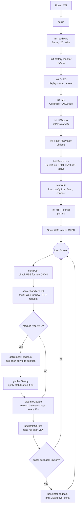
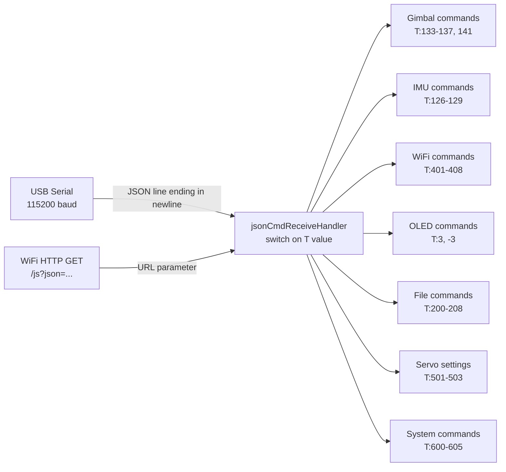
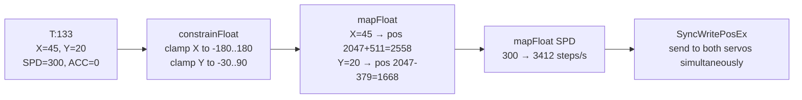
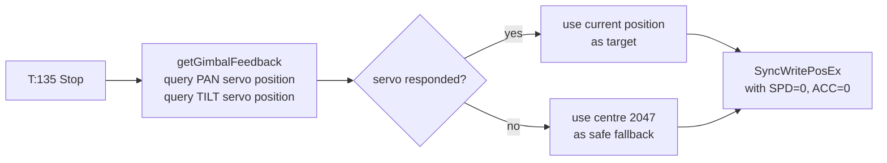
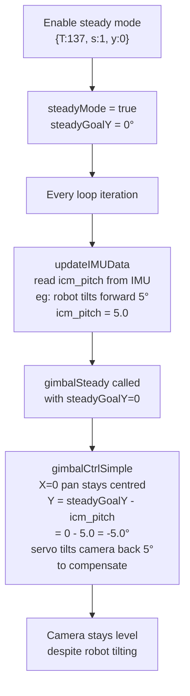
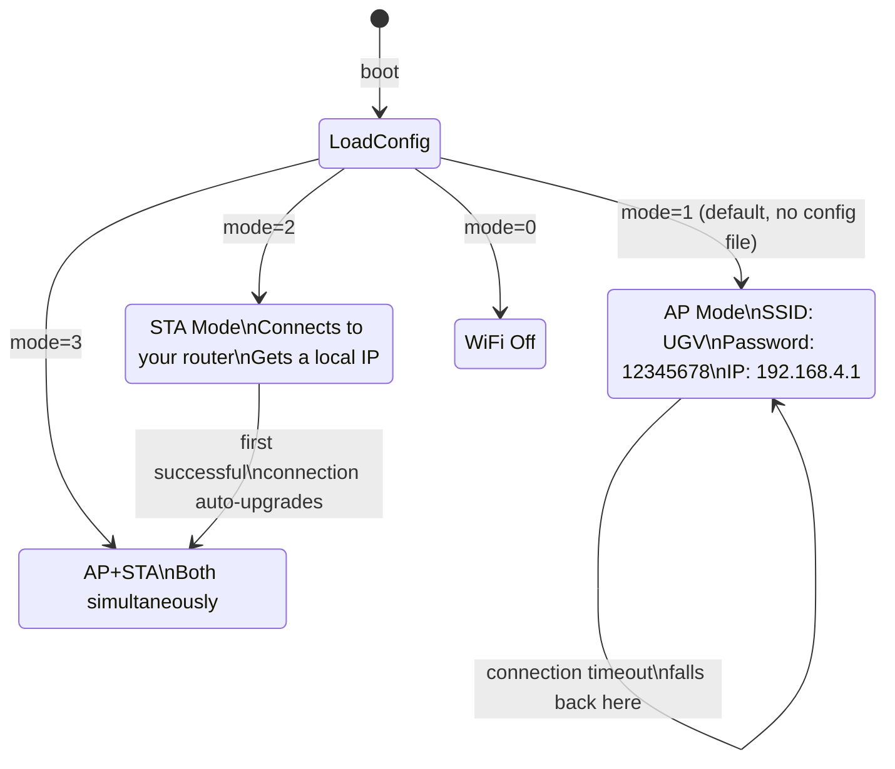
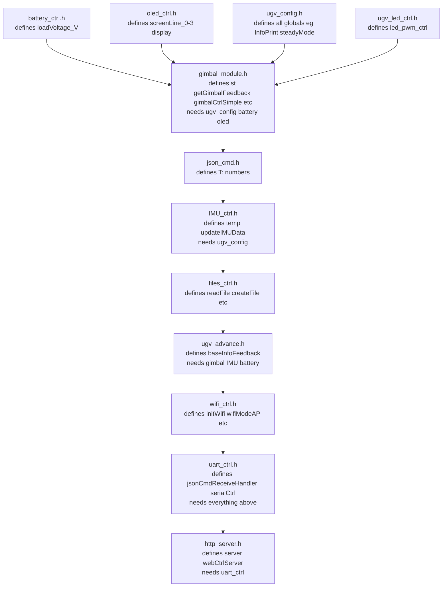

# Gimbal Firmware — How It Works
### A Plain-English Architecture Guide
**Branch:** `feature/gimbal-impl`

---

## What Is This?

This is firmware for a **pan-tilt gimbal** — a motorised camera mount that can rotate left/right (pan) and up/down (tilt). It runs on an **ESP32** microcontroller, a small chip roughly the size of a stamp that has WiFi built-in.

You can control the gimbal three ways:
1. **USB cable** → send text commands from a computer terminal
2. **WiFi** → send commands from a phone, browser, or Python script on the same network
3. **Onboard stabilisation** → the gimbal uses a built-in motion sensor to keep itself level automatically

---

## The Physical Hardware

```
┌─────────────────────────────────────────────────────────────────────┐
│                          HARDWARE OVERVIEW                          │
│                                                                     │
│   ┌──────────┐   USB       ┌─────────────┐   GPIO 18/19  ┌───────┐ │
│   │ Computer │ ──────────► │             │ ─────────────► │  PAN  │ │
│   │ Terminal │             │   ESP32     │                │ SERVO │ │
│   └──────────┘             │ (the brain) │                └───────┘ │
│                            │             │   GPIO 18/19  ┌───────┐ │
│   ┌──────────┐   WiFi      │             │ ─────────────► │ TILT  │ │
│   │  Phone / │ ──────────► │             │                │ SERVO │ │
│   │ Browser  │             └─────────────┘                └───────┘ │
│   └──────────┘                   │                                  │
│                            ┌─────┴──────┐                           │
│                            │  I2C Bus   │  (shared wire)            │
│                            │ GPIO 32/33 │                           │
│                            └─────┬──────┘                           │
│                    ┌─────────────┼─────────────┐                    │
│                 ┌──┴──┐       ┌──┴──┐       ┌──┴──┐                 │
│                 │ IMU │       │OLED │       │BAT  │                 │
│                 │0x6B │       │0x3C │       │0x42 │                 │
│                 └─────┘       └─────┘       └─────┘                 │
└─────────────────────────────────────────────────────────────────────┘
```

| Component | What it does | How connected |
|-----------|-------------|---------------|
| **ESP32** | The brain — runs all the code | — |
| **PAN servo** (ID=2) | Rotates the camera left/right, ±180° | GPIO 18/19 (UART) |
| **TILT servo** (ID=1) | Tilts the camera up/down, -30° to +90° | GPIO 18/19 (UART) |
| **IMU** (QMI8658 + AK09918) | Measures tilt/rotation of the robot body | I2C at 0x6B / 0x0C |
| **OLED display** (SSD1306) | 4-line text screen showing WiFi info + battery | I2C at 0x3C |
| **Battery monitor** (INA219) | Measures battery voltage and current | I2C at 0x42 |

---

## The Servo Bus — How Commands Reach the Motors

The two servo motors are **smart** — they each have a little computer inside and understand digital commands. Both servos share a **single wire pair** (GPIO 18 and 19), like a small internal network.

```
                    HALF-DUPLEX UART at 1,000,000 baud
                    ╔══════════════════════════════════╗
  ESP32             ║  Header  ID  Len  Cmd  Params  CRC ║
  GPIO 18 (RX) ─────║──────────────────────────────────║──► SERVO ID=2 (PAN)
  GPIO 19 (TX) ─────║──────────────────────────────────║──► SERVO ID=1 (TILT)
                    ╚══════════════════════════════════╝
                          Feetech SMS_STS Protocol
```

"Half-duplex" means the wire can only carry data one direction at a time — the ESP32 either talks or listens, never both simultaneously. The `SCServo` library handles all this timing automatically.

A typical servo move command looks like:
```
0xFF 0xFF  02  08  83  FF 07  ...  checksum
 sync      ID  len cmd  pos  spd  acc
```
- `0xFF 0xFF` = start marker (every packet begins with these two bytes)
- `02` = which servo (PAN = 2)
- Position range = 0 to 4095, where 2047 = centre

---

## Overall Software Architecture

The firmware is structured as a **single-threaded main loop** — there is no multitasking. Every iteration of the loop, the ESP32 checks for new commands and runs the gimbal logic.



---

## The Three Ways to Send Commands

All three input channels funnel into the **exact same handler function** (`jsonCmdReceiveHandler`). The format is always JSON — a simple text structure like `{"T":133,"X":45,"Y":20,"SPD":300,"ACC":0}`.



### USB serial path (`serialCtrl`)
The ESP32 watches the USB serial port character by character. When it sees a newline `\n`, it tries to parse everything collected so far as JSON. If it parses successfully, it calls the handler. If not (garbled data), it silently discards and waits for the next newline.

### WiFi HTTP path (`http_server.h`)
The ESP32 runs a tiny web server on port 80. When an HTTP GET request arrives at `/js`, the URL argument (e.g. `?{"T":133,...}`) is extracted and parsed as JSON, then the same handler is called. The response is whatever was written to `jsonInfoHttp` during handling.

---

## The Gimbal Control System

### Coordinate System

```
           +90° (up)
              │
              │
   -180° ─────┼───── +180°   (PAN: left = negative, right = positive)
    (left)    │     (right)
              │
           -30° (down)
```

Centre of both axes = position 2047 in servo steps (0–4095 range).

### The Four Gimbal Commands

#### `{"T":133,"X":45,"Y":20,"SPD":300,"ACC":0}` — Simple absolute move
Move to exactly X=45° pan, Y=20° tilt at speed 300.



The `mapFloat` formula converts human-readable degrees to the raw 0–4095 servo position scale:
- Pan 0° → servo 2047 (centre)
- Pan +180° → servo 4094 (full right)
- Pan -180° → servo 0 (full left)

#### `{"T":134,"X":45,"Y":20,"SX":500,"SY":300}` — Move with independent speeds
Same as above but SX (pan speed) and SY (tilt speed) can differ. Useful for diagonal movements that should arrive at the same time.

#### `{"T":135}` — Stop (hold position)
Reads the current position from each servo, then immediately commands that same position — so the servo holds exactly where it is with full torque.



#### `{"T":141,"X":1,"Y":0,"SPD":300}` — Joystick/incremental control
Designed for joystick-style input. X and Y values are directions, not absolute angles:
- `-1` = move toward minimum
- `+1` = move toward maximum
- `0` = stop this axis (hold current position)
- `2, 2` = return to centre

When an axis value is `0`, the firmware reads the servo's current position and stores it as the new goal — so the camera stays exactly where it stopped.

---

## Stabilisation Mode



The idea: if the robot tilts forward by 5°, the firmware tilts the camera backward by 5°, so the view stays horizontal. The `steadyGoalY` parameter lets you set the desired resting tilt angle (e.g. `y:10` means "keep camera pointing 10° upward regardless of body movement").

---

## The IMU — Measuring Movement

The IMU (Inertial Measurement Unit) contains two sensors:
- **QMI8658** — accelerometer (measures gravity direction) + gyroscope (measures rotation rate)
- **AK09918** — magnetometer (compass, measures magnetic north)

These are fused together by the `IMU.cpp` AHRS algorithm to produce:
- **Roll** (`icm_roll`) — left/right tilt of the robot body
- **Pitch** (`icm_pitch`) — forward/backward tilt ← used by stabilisation
- **Yaw** (`icm_yaw`) — rotation around vertical axis (compass heading)

The IMU is read every loop iteration via `updateIMUData()`.

---

## The OLED Display

The 128×32 pixel display shows 4 lines of text. Two modes:

```
┌────────────────────────────┐    ┌────────────────────────────┐
│ AP:UGV                     │    │ Custom text line 0         │
│ ST:192.168.1.105           │    │ Custom text line 1         │
│ (blank)                    │    │ Custom text line 2         │
│ V:12.34                    │    │ Custom text line 3         │
└────────────────────────────┘    └────────────────────────────┘
     DEFAULT MODE                       CUSTOM MODE
  (WiFi info + battery)              (set via T:3 command)
```

- **Default mode** auto-updates battery voltage every 10 seconds.
- **Custom mode** is entered when you send `{"T":3,"lineNum":0,"Text":"hello"}` — you control each line individually.
- Send `{"T":-3}` to return to default mode.

---

## WiFi System



On first boot (no config file), the ESP32 creates its own WiFi hotspot named **"UGV"** with password **"12345678"**. You connect to it and can control the gimbal immediately.

Once you send it your router's WiFi credentials (command `T:403`), it connects to your network. On success it automatically saves this as the new boot mode so it reconnects automatically next time.

The config is stored in flash as `/wifiConfig.json`.

---

## Flash File System (LittleFS)

The ESP32 has ~1.5 MB of flash storage available for files. The firmware uses this to store:
- `/wifiConfig.json` — WiFi credentials and boot mode
- Any custom files you create via commands

File commands:

| Command | T code | Example |
|---------|--------|---------|
| List all files | 200 | `{"T":200}` |
| Create file | 201 | `{"T":201,"name":"test.txt","content":"hello"}` |
| Read file | 202 | `{"T":202,"name":"test.txt"}` |
| Delete file | 203 | `{"T":203,"name":"test.txt"}` |
| Append line | 204 | `{"T":204,"name":"test.txt","content":"newline"}` |
| Replace line | 206 | `{"T":206,"name":"test.txt","lineNum":1,"content":"replaced"}` |

---

## Battery Monitor

The INA219 chip measures:
- **Bus voltage** — the main battery voltage in volts (displayed on OLED as `V:12.34`)
- **Current** — how much current the system is drawing in milliamps
- **Power** — voltage × current in milliwatts

The battery reading updates every 10 seconds in the main loop (via `oledInfoUpdate`) and is included in every `baseInfoFeedback` message.

---

## Feedback System

The firmware can continuously stream status data over serial. Enable with `{"T":131,"cmd":1}`.

Every feedback message looks like:
```json
{"T":1001,"r":0.12,"p":-2.3,"y":180.5,"temp":32.1,"v":12.4,"pan":45.0,"tilt":10.0}
```

| Field | Meaning |
|-------|---------|
| `T:1001` | Message type: base info |
| `r` | Roll — left/right tilt of robot body in degrees |
| `p` | Pitch — forward/backward tilt in degrees |
| `y` | Yaw — compass heading in degrees |
| `temp` | ESP32 chip temperature in °C |
| `v` | Battery voltage in volts |
| `pan` | Current pan angle in degrees (-180 to +180) |
| `tilt` | Current tilt angle in degrees (-30 to +90) |

Set the rate with `{"T":142,"cmd":50}` (50 ms between messages = 20 Hz).

---

## Full Command Reference

### Gimbal Control

| Command | Description | Example |
|---------|-------------|---------|
| `T:133` | Move to absolute angle | `{"T":133,"X":45,"Y":-10,"SPD":300,"ACC":0}` |
| `T:134` | Move with per-axis speed | `{"T":134,"X":45,"Y":20,"SX":500,"SY":200}` |
| `T:135` | Stop (hold position) | `{"T":135}` |
| `T:137` | Steady/stabilisation mode | `{"T":137,"s":1,"y":0}` — on; `{"T":137,"s":0,"y":0}` — off |
| `T:141` | Joystick control | `{"T":141,"X":1,"Y":0,"SPD":300}` |
| `T:210` | All servos torque on/off | `{"T":210,"cmd":0}` off; `{"T":210,"cmd":1}` on |

### IMU / Sensor

| Command | Description |
|---------|-------------|
| `T:126` | Get current IMU angles + raw data |
| `T:130` | Get one base feedback packet |
| `T:131` | Toggle continuous feedback stream |
| `T:142` | Set feedback interval (ms) |

### WiFi

| Command | Description | Example |
|---------|-------------|---------|
| `T:402` | Set AP mode | `{"T":402,"ssid":"MyGimbal","password":"12345678"}` |
| `T:403` | Connect to router | `{"T":403,"ssid":"HomeWifi","password":"mypassword"}` |
| `T:405` | Get WiFi status | `{"T":405}` |
| `T:408` | Disconnect WiFi | `{"T":408}` |

### Display

| Command | Description | Example |
|---------|-------------|---------|
| `T:3` | Write a line on OLED | `{"T":3,"lineNum":0,"Text":"Hello"}` |
| `T:-3` | Return OLED to default | `{"T":-3}` |

### System

| Command | Description |
|---------|-------------|
| `T:600` | Reboot ESP32 |
| `T:601` | Free flash space |
| `T:604` | Clear NVS (fix corrupt WiFi) |
| `T:605` | Set debug print level (0=off, 1=on, 2=flow) |

### Servo Settings (advanced)

| Command | Description | Example |
|---------|-------------|---------|
| `T:501` | Change servo ID | `{"T":501,"raw":2,"new":3}` |
| `T:502` | Set current pos as zero | `{"T":502,"id":2}` |
| `T:503` | Set servo P gain | `{"T":503,"id":2,"p":32}` |

---

## File Structure

```
General_Driver/
├── General_Driver.ino  ← main file: setup() and loop()
├── ugv_config.h        ← all global variables and pin definitions
├── gimbal_module.h     ← all gimbal logic + servo bus object
├── IMU_ctrl.h          ← IMU read and data update
├── battery_ctrl.h      ← INA219 battery monitor
├── oled_ctrl.h         ← OLED display control
├── ugv_led_ctrl.h      ← LED PWM on GPIO 4 and 5
├── files_ctrl.h        ← LittleFS file read/write/delete
├── ugv_advance.h       ← feedback functions, config setters
├── wifi_ctrl.h         ← WiFi AP/STA/AP+STA management
├── uart_ctrl.h         ← JSON command parser and dispatcher
├── json_cmd.h          ← command number definitions (#define T:133 etc.)
├── http_server.h       ← HTTP web server on port 80
├── web_page.h          ← HTML for the built-in web interface
├── IMU.h / IMU.cpp     ← AHRS fusion algorithm
├── QMI8658.h/cpp       ← accelerometer + gyroscope driver
└── AK09918.h/cpp       ← magnetometer driver
```

---

## Include Order and Why It Matters

The `.h` files are included in a specific order in `General_Driver.ino`. Each file can only use things defined in files included before it.



---

## Known Limitations (Not Bugs — Design Choices)

1. **WiFi connection blocks during `wifiModeSTA()`** — while the ESP32 is trying to connect to a router (up to 15 seconds), no serial or gimbal commands are processed. This only happens at boot or if you manually trigger a WiFi mode change.

2. **Stabilisation always resets pan to 0°** — when steady mode is on, every loop iteration calls `gimbalCtrlSimple(0, compensated_tilt, 0, 0)`. The `0` for X means pan is always pushed toward centre. You cannot pan the camera while stabilisation is active.

3. **No position persistence across reboot** — the gimbal does not save its last position. After reboot it returns to wherever the servos happen to be physically (no home sequence).

4. **Single-threaded** — the ESP32 runs everything in one loop. Heavy WiFi operations (long connection attempts) briefly pause servo updates.
